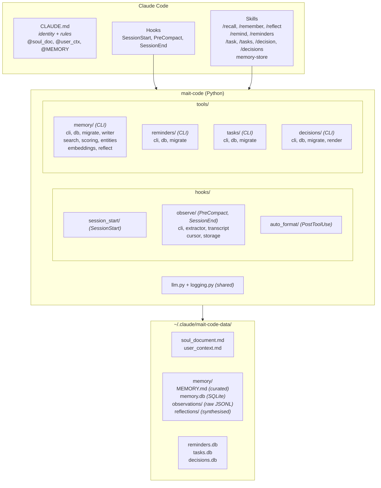
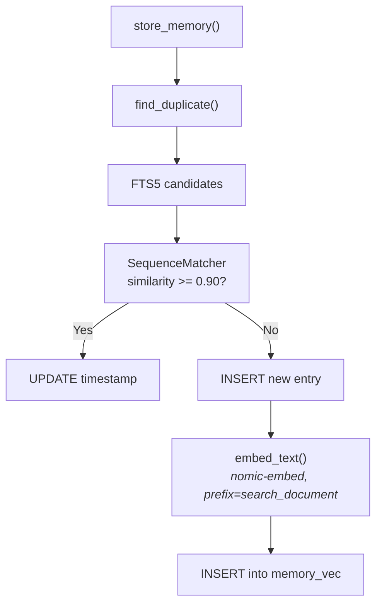
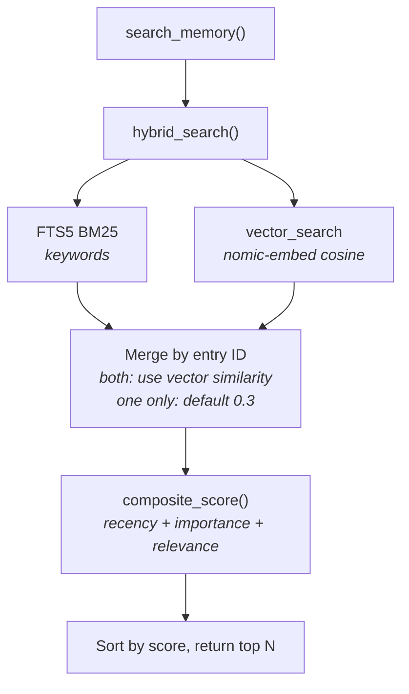
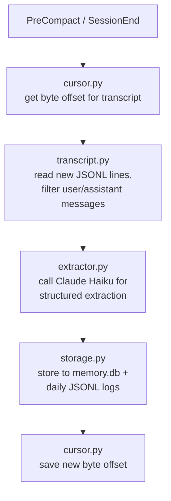

# Architecture

## Design Principles

1. **No background services** — Everything runs reactively in response to Claude Code events (hooks, CLI invocations). No daemons, no cron jobs.
2. **Standalone project** — Self-contained Python package managed by `uv`. No system-wide installation required.
3. **Memory-first** — The memory system is the core differentiator. All other features feed into or read from memory.
4. **Companion identity** — Not a generic assistant. The soul document and user context create a consistent personality.
5. **uv-managed** — All Python execution goes through `uv run --project`. No manual venv activation.
6. **CLI tools + skills over MCP** — Simpler, no process overhead, preprocessing injects results before Claude sees the prompt.

## System Architecture



## Memory Architecture

### Overview

The memory system combines three tiers of storage with a SQLite database for structured search. Raw observations flow in from hooks, get indexed in the database, and the highest-confidence facts are promoted to MEMORY.md for always-on context.

### Database Schema

The memory database (`memory.db`) uses SQLite with two extensions:

**Core table: `memory_entries`**

| Column | Type | Description |
|--------|------|-------------|
| `id` | INTEGER PK | Auto-incrementing identifier |
| `content` | TEXT | The memory content |
| `entry_type` | TEXT | fact, preference, event, insight, task, relationship |
| `importance` | INTEGER | 1-10 scale (default 5) |
| `memory_class` | TEXT | episodic or semantic (controls decay rate) |
| `created_at` | DATETIME | Timestamp of creation |

**Entry type to memory class mapping:**
- **Episodic** (fast decay, 3-day half-life): `event`, `task`
- **Semantic** (slow decay, 90-day half-life): `fact`, `preference`, `insight`, `relationship`

**FTS5 virtual table: `memory_entries_fts`**
- Full-text search with BM25 ranking
- Kept in sync via triggers on insert/update/delete

**Vec0 virtual table: `memory_vec`**
- 768-dimension cosine distance vectors via `sqlite-vec`
- Populated by `fastembed` using the `nomic-ai/nomic-embed-text-v1.5` model
- Embeddings are computed and stored automatically when new memory entries are created
- Delete trigger (`memory_entries_vec_ad`) keeps vec table in sync when entries are removed

**Entity table: `memory_entities`**

| Column | Type | Description |
|--------|------|-------------|
| `id` | INTEGER PK | Auto-incrementing identifier |
| `name` | TEXT UNIQUE NOCASE | Entity name (case-insensitive) |
| `entity_type` | TEXT | person, project, tool, service, concept, org, unknown |
| `first_seen` | DATETIME | When the entity was first observed |
| `last_seen` | DATETIME | When the entity was last mentioned |
| `mention_count` | INTEGER | How many times the entity has been seen |

**Relationship table: `memory_relationships`**

| Column | Type | Description |
|--------|------|-------------|
| `id` | INTEGER PK | Auto-incrementing identifier |
| `source_entity_id` | INTEGER FK | References memory_entities |
| `target_entity_id` | INTEGER FK | References memory_entities |
| `relationship_type` | TEXT | uses, owns, contributes_to, depends_on, manages, related_to |
| `context` | TEXT | Description of the relationship |
| `first_seen` | DATETIME | When the relationship was first observed |
| `last_seen` | DATETIME | When the relationship was last seen |

Unique constraint on `(source_entity_id, target_entity_id, relationship_type)`.

**Indexes:**
- `idx_memory_entries_created_at` — temporal queries
- `idx_memory_entries_type` — type filtering
- `idx_memory_entries_importance` — importance ranking
- `idx_memory_entries_class` — class filtering
- `idx_entities_name` — entity name lookup
- `idx_entities_type` — entity type filtering
- `idx_rel_unique` — relationship deduplication
- `idx_rel_source`, `idx_rel_target` — relationship traversal

### Composite Scoring

Memory retrieval results are ranked by a composite score:

```
score = 0.3 × recency + 0.3 × importance + 0.4 × relevance
```

**Recency** uses exponential decay:
- `recency = exp(-ln(2) × age_days / half_life)`
- Episodic half-life: 3 days (events decay fast)
- Semantic half-life: 90 days (facts persist)
- Default half-life: 7 days (unknown class)

**Importance** is normalized from 1-10 to 0.0-1.0:
- `importance_norm = (importance - 1) / 9`

**Relevance** is provided by the search method:
- **Hybrid mode** (default): combines FTS5 BM25 with vector cosine similarity
- **FTS mode**: keyword-only BM25 ranking
- **Vector mode**: semantic similarity only via nomic-embed embeddings

### Deduplication

Before storing a new memory, the writer checks for near-duplicates:

1. Extract first 8 significant words (length > 2) from new content
2. Query FTS5 for candidate matches (up to 20)
3. Compare each candidate using `SequenceMatcher`
4. If similarity >= 0.90: update existing entry's timestamp and keep max importance
5. If no match: insert as new entry

### Data Flow





### Tier 1: Observations (raw)
- Extracted automatically by the `observe` hook at PreCompact and SessionEnd
- Stored as JSONL files in `memory/observations/YYYY-MM-DD.jsonl`
- Contains facts, decisions, code patterns, user preferences, entities, and relationships
- Indexed into `memory.db` for structured search
- Entities and relationships stored in the knowledge graph tables

### Tier 2: Reflections (synthesised)
- Generated by `/reflect` skill or `mc-tool-memory reflect` CLI
- Reads unreflected memory entries (tracked by per-project watermark)
- Calls Claude Haiku to identify patterns, themes, recurring issues
- Stores insights as `type=insight` (importance=6) in memory.db
- Proposes MEMORY.md additions for user approval
- Idempotent: watermark advances after each reflection; same entries never processed twice
- Batched: configurable batch size (default 50), `--drain` for full backlog processing

### Tier 3: MEMORY.md (curated)
- The highest-confidence facts, loaded into every session via CLAUDE.md
- Manually edited or updated by the reflection system
- Kept under ~150 lines for context budget

## Memory CLI Tool (`mc-tool-memory`)

Sync CLI tool invoked via Bash. Skills use preprocessing (`!`command``) or direct Bash calls.

| Subcommand | Args | Description |
|------------|------|-------------|
| `search` | query, --limit?, --type?, --mode? | Hybrid (FTS5 + vector) search with composite score re-ranking |
| `store` | content, --type?, --importance? | Store with deduplication, auto-computes embedding |
| `list` | --limit?, --type?, --since? | List recent entries, optionally filtered by type and time period (e.g. `24h`, `7d`, `1w`) |
| `delete` | id | Delete by ID (vec cleanup via trigger) |
| `stats` | — | Counts by type, class, and embedding coverage |
| `entities` | query?, --limit? | Search or list knowledge graph entities |
| `relationships` | entity_name | Show relationships for an entity |
| `reindex` | — | Recompute vector embeddings for all entries |
| `restore` | --dry-run? | Restore memory database from observation JSONL log files, then reindex |
| `reflect` | --days?, --min-new?, --batch-size?, --drain? | Synthesise observations into insights, propose MEMORY.md updates |

## Tasks Database

The tasks database (`tasks.db`) stores per-project tasks.

**Tasks table: `tasks`**

| Column | Type | Description |
|--------|------|-------------|
| `id` | INTEGER PK | Auto-incrementing identifier |
| `project` | TEXT | Project identifier (basename of git root or cwd) |
| `title` | TEXT | Task description |
| `priority` | TEXT | `low`, `medium`, or `high` (default: `medium`) |
| `status` | TEXT | `open` or `done` (default: `open`) |
| `created_at` | DATETIME | Timestamp of creation |
| `completed_at` | DATETIME | Timestamp of completion (null if open) |

Project detection uses `mait_code.context.get_project()` — the basename of the git root or current working directory.

## Tasks CLI Tool (`mc-tool-tasks`)

Per-project task tracking. Tasks are scoped by the basename of the git root (or cwd for non-git directories), stored in a shared `tasks.db`.

| Subcommand | Args | Description |
|------------|------|-------------|
| `add` | title, --priority? | Add a task (low/medium/high, default: medium) |
| `list` | --all? | List open tasks (or all including completed) |
| `done` | id | Mark a task as completed |
| `remove` | id | Remove a task |
| `check` | --project? | List open tasks for current project (used by session_start hook) |
| `list-all` | — | List open tasks across all projects |

## Decisions Database

The decisions database (`decisions.db`) stores project-scoped technical decision records (ADR-lite).

**Decisions table: `decisions`**

| Column | Type | Description |
|--------|------|-------------|
| `id` | INTEGER PK | Auto-incrementing identifier |
| `project` | TEXT | Project identifier (basename of git root or cwd) |
| `title` | TEXT | Decision title |
| `context` | TEXT | Problem or situation that prompted this |
| `alternatives` | TEXT | Other options considered |
| `consequences` | TEXT | Known trade-offs |
| `status` | TEXT | `accepted`, `proposed`, `deprecated`, or `superseded` (default: `accepted`) |
| `superseded_by` | INTEGER FK | References decisions(id) |
| `tags` | TEXT | Comma-separated tags |
| `created_at` | DATETIME | Timestamp of creation |
| `updated_at` | DATETIME | Timestamp of last update |

**FTS5 virtual table: `decisions_fts`** — full-text search across title, context, alternatives, and consequences. Kept in sync via insert/update/delete triggers.

## Decisions CLI Tool (`mc-tool-decisions`)

Project-scoped decision records with full-text search and automatic markdown rendering.

| Subcommand | Args | Description |
|------------|------|-------------|
| `record` | title, --context?, --alternatives?, --consequences?, --status?, --tags? | Record a new decision |
| `list` | --all?, --tag?, --status? | List decisions (default: accepted + proposed only) |
| `show` | id | Show full decision details |
| `amend` | id, --context?, --alternatives?, --consequences?, --status?, --tags? | Update specific fields |
| `supersede` | old_id, new_id | Mark old decision as superseded by new |
| `search` | query | FTS5 full-text search across all fields |
| `remove` | id | Delete a decision (clears superseded_by references) |
| `sync` | — | Manually regenerate `docs/decisions.md` |

Every mutation auto-regenerates `docs/decisions.md` at the project's git root with a summary table and full decision sections.

## Reminders CLI Tool (`mc-tool-reminders`)

| Subcommand | Args | Description |
|------------|------|-------------|
| `set` | when, what | Schedule a reminder with natural language time parsing |
| `list` | --all? | List active (or all) reminders |
| `dismiss` | id | Dismiss a reminder by ID |
| `check` | — | Check for overdue reminders (used by session_start hook) |

## Hooks

| Hook | Trigger | Mode | Purpose |
|------|---------|------|---------|
| `session_start` | SessionStart | sync | Inject companion context (reminders, project tasks) |
| `observe` | PreCompact | async | Extract observations before context compaction |
| `observe` | SessionEnd | sync | Final observation extraction |
| `auto_format` | — | — | Format code after edits (placeholder) |

The observe hook on PreCompact runs asynchronously (`"async": true`) to avoid blocking the main conversation. It calls Claude Haiku to extract structured observations (facts, preferences, decisions, bugs, entities, relationships) from new transcript lines.

## Observation Pipeline



## Logging

All entry points use a shared logging module (`src/mait_code/logging.py`) that writes to rotating log files. Logs never go to stdout/stderr to avoid interfering with hook JSON output.

**Configuration** (via `settings.json` `env` block or shell environment):

| Variable | Default | Description |
|----------|---------|-------------|
| `MAIT_CODE_LOG_LEVEL` | `INFO` | `DEBUG`, `INFO`, `WARNING`, `ERROR` |
| `MAIT_CODE_LOG_FILE` | `~/.claude/mait-code-data/logs/mait-code.log` | Override log file path |

**Features:**
- `setup_logging()` — call once per entry point; idempotent, configures the `mait_code` logger hierarchy
- `@log_invocation(name=...)` — decorator that logs command name, parsed arguments, duration, and exit status
- Sensitive parameters (`content`, `query`, `what`, `prompt`, `message`) are automatically truncated to 80 chars
- `RotatingFileHandler` — 5 MB max, 3 backups

**Log format:**
```
2026-03-08T14:23:01 INFO  mait_code.tools.memory.cli — invoked: mc-tool-memory query="dark mo..." limit=10 mode='hybrid'
2026-03-08T14:23:01 DEBUG mait_code.tools.memory.search — Vector search: 3 results
2026-03-08T14:23:01 INFO  mait_code.invocation — completed: mc-tool-memory (0.42s)
```

## Identity System

Three files compose the companion's identity:

1. **Soul Document** — Values, personality, communication style (stable, rarely changes)
2. **User Context** — Who the user is, their stack, preferences (updates occasionally)
3. **MEMORY.md** — Accumulated knowledge (updates frequently)

All three are referenced via `@` imports in `config/CLAUDE.md` and loaded into every Claude Code session.

## Migration System

Schema changes are managed via forward-only migrations in `src/mait_code/tools/memory/migrate.py`. Each migration has a version number, description, and body (SQL list or callable). The `schema_version` table tracks which migrations have been applied.

Current migrations:
1. `memory_entries` table with indexes
2. FTS5 virtual table for full-text search
3. FTS sync triggers (insert/update/delete)
4. Vec0 virtual table for vector search (1536-dim, superseded by migration 7)
5. `memory_entities` table for entity tracking
6. `memory_relationships` table for entity relationships
7. Recreate vec0 with 768 dimensions for nomic-embed-text-v1.5, add vec delete trigger

Adding a new migration:
1. Append a tuple to `MIGRATIONS` with the next version number
2. Include SQL statements or a callable that receives `conn`
3. `ensure_schema()` runs automatically on every connection open

## Data Directory

```
~/.claude/mait-code-data/
├── soul_document.md          # Companion identity
├── user_context.md           # User profile
├── memory/
│   ├── MEMORY.md             # Curated facts (loaded every session)
│   ├── memory.db             # SQLite FTS5 + vec0 + entities database
│   ├── observations/         # Raw JSONL session extractions
│   │   ├── YYYY-MM-DD.jsonl
│   │   └── cursors.json      # Byte offset tracking per transcript
│   └── reflections/          # Synthesised insights
│       └── YYYY-MM.md
├── models/                   # Cached embedding models (fastembed)
├── logs/                     # Rotating log files
│   ├── mait-code.log         # Current log
│   ├── mait-code.log.1       # Rotated backups
│   └── ...
├── reminders.db              # Reminder database
├── tasks.db                  # Per-project tasks database
└── decisions.db              # Decision records database
```

## Key Technical Decisions

| Decision | Rationale |
|----------|-----------|
| uv over pip/poetry | Fastest resolver, built-in project management, `uv run` eliminates venv activation |
| SQLite + FTS5 + sqlite-vec | Zero infrastructure, single file, portable, keyword + vector search in one DB |
| JSONL for observations | Append-only, merge-friendly for git sync, one object per line |
| Hooks over background services | No daemons to manage, reactive model fits Claude Code's architecture |
| CLI tools + skills over MCP | No process overhead, preprocessing injects results before Claude sees the skill, simpler debugging |
| Symlinks over file copying | Updates propagate automatically via `git pull`, no re-install needed |
| Exponential decay scoring | Recent memories surface naturally, old ones fade unless high importance |
| Dedup via FTS5 + SequenceMatcher | Fast candidate narrowing, precise similarity comparison, no duplicates |
| Async observation hook | PreCompact extraction runs in background, no conversation latency |
| Entity tables over separate graph DB | Entities live in memory.db alongside memories — single file, recursive CTEs for future traversal |
| fastembed over sentence-transformers | ONNX Runtime only (~80 MB), no PyTorch (~2 GB); ~300 MB RAM at runtime |
| nomic-embed-text-v1.5 @ 768 dims | Full-quality representation; 8192 token context; MTEB ~62.4; negligible storage cost at expected scale |
| Hybrid search (FTS5 + vector) | Keywords catch exact matches, vectors catch semantic similarity; graceful degradation to FTS-only if embeddings unavailable |
| File-based rotating logs | No stdout/stderr interference with hook JSON; configurable via env vars; `RotatingFileHandler` keeps log size bounded |
| Watermark table for reflection idempotency | Separate table over `reflected_at` column — atomic batch tracking, no feedback loops, clean separation of concerns |
| Decisions in SQLite + FTS5 | Consistent with existing tool patterns; full-text search across decision fields; auto-rendered to `docs/decisions.md` for git-friendly visibility |
