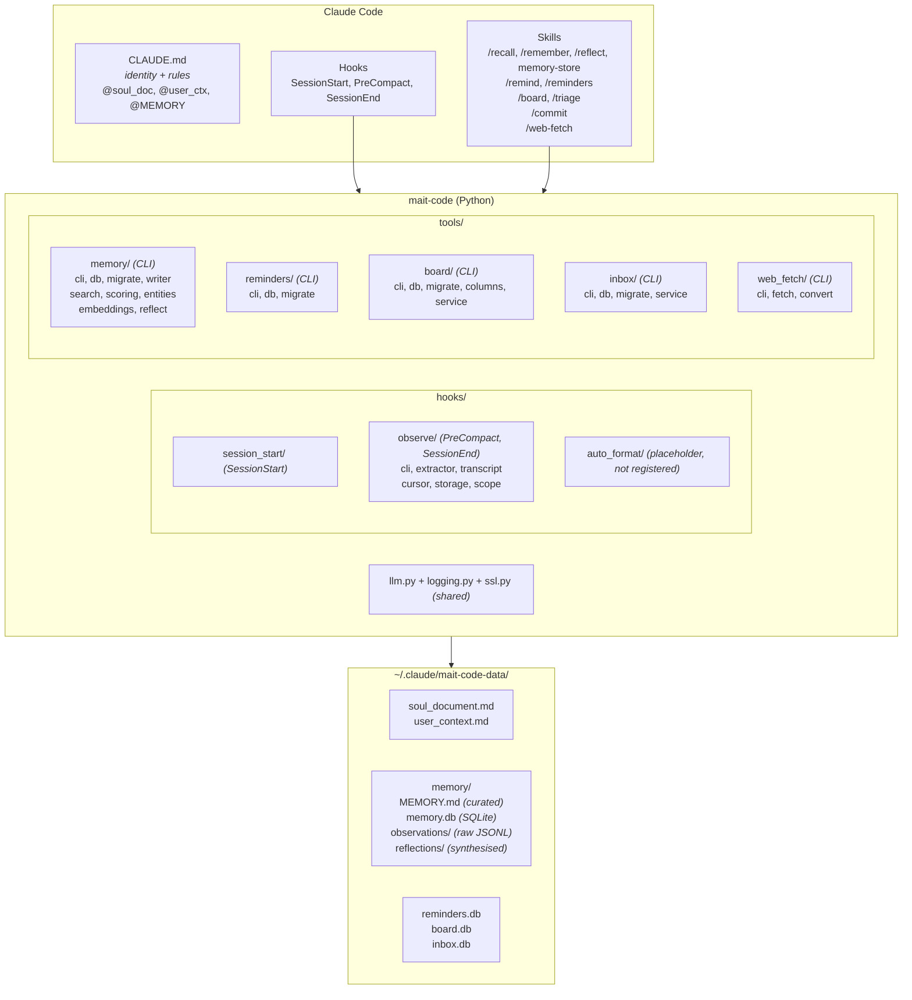
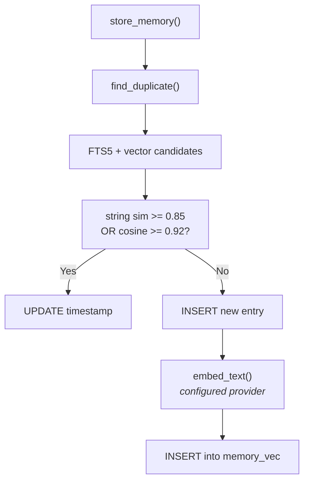
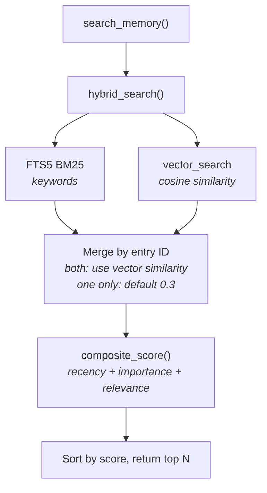
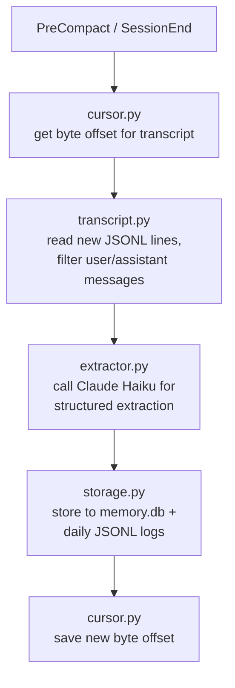

# Architecture

## Design Principles

1. **No background services** — Everything runs reactively in response to Claude Code events (hooks, CLI invocations). No daemons, no cron jobs.
2. **Standalone project** — Self-contained Python package managed by `uv`. No system-wide installation required.
3. **Memory-first** — The memory system is the core differentiator. All other features feed into or read from memory.
4. **Companion identity** — Not a generic assistant. The soul document and user context create a consistent personality.
5. **uv-managed** — All Python execution goes through `uv run --project`. No manual venv activation.
6. **CLI tools + skills over MCP** — Simpler, no process overhead, preprocessing injects results before Claude sees the prompt.

## System Architecture



## Memory Architecture

### Overview

The memory system combines three tiers of storage with a SQLite database for structured search. Raw observations flow in from hooks, get indexed in the database, and the highest-confidence facts are promoted to MEMORY.md for always-on context.

### Database Schema

The memory database (`memory.db`) uses SQLite with two extensions:

**Core table: `memory_entries`**

| Column | Type | Description |
|--------|------|-------------|
| `id` | INTEGER PK | Auto-incrementing identifier |
| `content` | TEXT | The memory content |
| `entry_type` | TEXT | fact, preference, event, decision, insight, task, relationship |
| `importance` | INTEGER | 1-10 scale (default 5) |
| `memory_class` | TEXT | episodic or semantic (controls decay rate) |
| `scope` | TEXT | `global`, `project`, or `branch` (default `global`) |
| `project` | TEXT | Project identifier (null for global scope) |
| `branch` | TEXT | Git branch (set only for branch scope) |
| `created_at` | DATETIME | Timestamp of creation |

**Scope semantics:**

- **global** — visible everywhere, `project` and `branch` are null
- **project** — visible across all branches of one project, `project` set, `branch` null
- **branch** — visible only on one branch of one project, both set
- Default at write time: `branch` if both project+branch detected, else `project` if project detected, else `global`. Override with `--scope`.
- Query-time default: filter by current context; `--scope all` disables filtering.

**Entry type to memory class mapping:**

- **Episodic** (fast decay, 3-day half-life): `event`, `task`
- **Semantic** (slow decay, 90-day half-life): `fact`, `preference`, `decision`, `insight`, `relationship`

**FTS5 virtual table: `memory_entries_fts`**
- Full-text search with BM25 ranking
- Kept in sync via triggers on insert/update/delete

**Vec0 virtual table: `memory_vec`**
- Cosine distance vectors via `sqlite-vec` (768d for local/nomic, 1024d for Bedrock/Titan)
- Populated by the configured embedding provider (local fastembed or AWS Bedrock)
- Embeddings are computed and stored automatically when new memory entries are created
- Delete trigger (`memory_entries_vec_ad`) keeps vec table in sync when entries are removed
- Dimension is a deployment-time decision; `mc-tool-memory reindex` handles migration

**Entity table: `memory_entities`**

| Column | Type | Description |
|--------|------|-------------|
| `id` | INTEGER PK | Auto-incrementing identifier |
| `name` | TEXT UNIQUE NOCASE | Entity name (case-insensitive) |
| `entity_type` | TEXT | person, project, tool, service, concept, org, unknown |
| `first_seen` | DATETIME | When the entity was first observed |
| `last_seen` | DATETIME | When the entity was last mentioned |
| `mention_count` | INTEGER | How many times the entity has been seen |

**Relationship table: `memory_relationships`**

| Column | Type | Description |
|--------|------|-------------|
| `id` | INTEGER PK | Auto-incrementing identifier |
| `source_entity_id` | INTEGER FK | References memory_entities |
| `target_entity_id` | INTEGER FK | References memory_entities |
| `relationship_type` | TEXT | uses, owns, contributes_to, depends_on, manages, related_to |
| `context` | TEXT | Description of the relationship |
| `first_seen` | DATETIME | When the relationship was first observed |
| `last_seen` | DATETIME | When the relationship was last seen |

Unique constraint on `(source_entity_id, target_entity_id, relationship_type)`.

**Indexes:**

- `idx_memory_entries_created_at` — temporal queries
- `idx_memory_entries_type` — type filtering
- `idx_memory_entries_importance` — importance ranking
- `idx_memory_entries_class` — class filtering
- `idx_memory_entries_scope` — scope filtering
- `idx_memory_entries_project` — project filtering
- `idx_memory_entries_project_scope` — combined project + scope lookups
- `idx_entities_name` — entity name lookup
- `idx_entities_type` — entity type filtering
- `idx_rel_unique` — relationship deduplication
- `idx_rel_source`, `idx_rel_target` — relationship traversal

**Reflection state: `reflection_watermark`**

Tracks the last `memory_entries.id` reflected on per project, so `/reflect` is idempotent across runs. Primary key on `project` (empty string for global). Columns: `project`, `last_reflected_id`, `last_reflected_at`.

### Composite Scoring

Memory retrieval results are ranked by a composite score:

```
score = 0.3 × recency + 0.3 × importance + 0.4 × relevance
```

**Recency** uses exponential decay:

- `recency = exp(-ln(2) × age_days / half_life)`
- Episodic half-life: 3 days (events decay fast)
- Semantic half-life: 90 days (facts persist)
- Default half-life: 7 days (unknown class)

**Importance** is normalized from 1-10 to 0.0-1.0:

- `importance_norm = (importance - 1) / 9`

**Relevance** is provided by the search method:

- **Hybrid mode** (default): combines FTS5 BM25 with vector cosine similarity
- **FTS mode**: keyword-only BM25 ranking
- **Vector mode**: semantic similarity only via the configured embedding provider

### Deduplication

Before storing a new memory, the writer checks for near-duplicates (scoped to the
new entry's project) using two complementary measures:

1. Extract first 8 significant words (length > 2) from new content
2. Gather candidates from **both** FTS5 keyword search and vector similarity search
3. Compare each candidate two ways: `SequenceMatcher` string similarity and vector cosine similarity
4. If string similarity ≥ `dedup-string-threshold` (default 0.85) **or** cosine similarity ≥ `dedup-vector-threshold` (default 0.92): treat as a duplicate — update the existing entry's timestamp and keep max importance
5. If no match: insert as new entry

### Data Flow





### Tier 1: Observations (raw)
- Extracted automatically by the `observe` hook at PreCompact and SessionEnd
- Stored as JSONL files in `memory/observations/YYYY-MM-DD.jsonl`
- Contains facts, decisions, code patterns, user preferences, entities, and relationships
- Indexed into `memory.db` for structured search
- Entities and relationships stored in the knowledge graph tables

### Tier 2: Reflections (synthesised)
- Generated by `/reflect` skill or `mc-tool-memory reflect` CLI
- Reads unreflected memory entries (tracked by per-project watermark)
- Calls Claude Haiku to identify patterns, themes, recurring issues
- Stores insights as `type=insight` (importance=6) in memory.db
- Proposes MEMORY.md additions for user approval
- Idempotent: watermark advances after each reflection; same entries never processed twice
- Batched: configurable batch size (default 50), `--drain` for full backlog processing

### Tier 3: MEMORY.md (curated)
- The highest-confidence facts, loaded into every session via CLAUDE.md
- Manually edited or updated by the reflection system
- Kept under ~150 lines for context budget

## Memory CLI Tool (`mc-tool-memory`)

Sync CLI tool invoked via Bash. Skills use preprocessing (`!`command``) or direct Bash calls.

| Subcommand | Args | Description |
|------------|------|-------------|
| `search` | query, --limit?, --type?, --mode?, --project?, --branch?, --scope? | Hybrid (FTS5 + vector) search with composite score re-ranking |
| `store` | content, --type?, --importance?, --project?, --branch?, --scope? | Store with deduplication, auto-computes embedding |
| `list` | --limit?, --type?, --since?, --project?, --branch?, --scope? | List recent entries, optionally filtered by type and time period (e.g. `24h`, `7d`, `1w`) |
| `delete` | id | Delete by ID (vec cleanup via trigger) |
| `stats` | — | Counts by type, class, scope, project, embedding coverage, and provider info |
| `entities` | query?, --limit? | Search or list knowledge graph entities |
| `relationships` | entity_name | Show relationships for an entity |
| `reindex` | — | Recompute vector embeddings for all entries |
| `restore` | --dry-run? | Restore memory database from observation JSONL log files, then reindex |
| `reflect` | --days?, --min-new?, --batch-size?, --drain?, --project?, --branch?, --scope? | Synthesise observations into insights, propose MEMORY.md updates |

Scope flags apply to every command that touches `memory_entries`: `--project` and `--branch` override the auto-detected context; `--scope` filters or sets the entry scope (`global`, `project`, `branch`, or `all` — the last disables filtering at query time).

## Board Database

The board database (`board.db`) stores a single cross-project kanban board. Cards carry a `project` field — so one board serves every project and UIs filter by it — and move through a fixed, hardcoded column workflow.

**Cards table: `cards`**

| Column | Type | Description |
|--------|------|-------------|
| `id` | INTEGER PK | Auto-incrementing identifier |
| `project` | TEXT | Project identifier (free-form; defaults to basename of git root or cwd) |
| `title` | TEXT | Card title |
| `description` | TEXT | The what/why |
| `acceptance_criteria` | TEXT | Definition-of-done; filled by the refine step |
| `status` | TEXT | Column: `backlog`, `refined`, `in_progress`, `done`, or `archived` (default `backlog`) |
| `priority` | TEXT | `low`, `medium`, or `high` (default `medium`) |
| `completion_summary` | TEXT | Handoff summary, set when moved to `done` |
| `created_at` | DATETIME | Timestamp of creation |
| `updated_at` | DATETIME | Timestamp of last mutation |
| `completed_at` | DATETIME | Timestamp of completion (null unless `done`) |

**Comments table: `card_comments`**

| Column | Type | Description |
|--------|------|-------------|
| `id` | INTEGER PK | Auto-incrementing identifier |
| `card_id` | INTEGER FK | References `cards(id)`; `ON DELETE CASCADE` |
| `author` | TEXT | `me` or `claude` (default `me`) |
| `body` | TEXT | Comment text |
| `created_at` | DATETIME | Timestamp of creation |

**Tags table: `card_tags`**

| Column | Type | Description |
|--------|------|-------------|
| `card_id` | INTEGER FK | References `cards(id)`; `ON DELETE CASCADE` |
| `tag` | TEXT | Free-form tag value; `UNIQUE(card_id, tag)` makes adding idempotent |

Free-form tags ride alongside a card's status. `blocked` is the first consumer: blocking tags a card in place rather than moving it, so the card keeps its real flow position. Each card dict carries a sorted `tags` list.

**Columns are fixed, not configurable.** `backlog → refined → in_progress → done` is the whole flow; `archived` is a hidden terminal excluded from default views. `blocked` is **not** a column — it is a tag carried in place (via `block`/`unblock`), so a blocked card keeps its real status. The constants live in `src/mait_code/tools/board/columns.py`. Project detection uses `mait_code.context.get_project()`; pass `--project` for work with no git repo (e.g. an app idea).

## Board CLI Tool (`mc-tool-board`)

Manually-driven kanban board. Claude in the live session acts as the worker ("pick up the next refined card"); there is no autonomous dispatcher — *you* drive the board. Cards are project-scoped via the basename of the git root (or cwd), stored in a shared `board.db`. Read commands accept `--json` for UI/skill consumption.

| Subcommand | Args | Description |
|------------|------|-------------|
| `add` | title, --description?, --priority?, --project? | Add a card to the backlog |
| `list` | --all?, --status?, --archived?, --json? | List cards grouped by column (current project by default; archived hidden) |
| `show` | id, --json? | Show a card and its comment thread |
| `move` | id, status | Move a card to any column (sets/clears `completed_at` around `done`) |
| `refine` | id, --description?, --acceptance? | Set description/acceptance and move to `refined` |
| `next` | --project?, --claim?, --json? | Show the next refined card (priority, then oldest); `--claim` moves it to `in_progress` |
| `complete` | id, --summary? | Move to `done` with a completion summary |
| `block` | id, reason? | Tag the card `blocked` in place (keeps its column); an optional reason is recorded as a comment |
| `unblock` | id | Remove the `blocked` tag (keeps the card's flow position) |
| `tag` | id, tag | Add a free-form tag to a card |
| `untag` | id, tag | Remove a tag from a card |
| `ref add` | id, label, value | Append a label→value reference (URL, `file://` path, or bare ID) to a card |
| `ref remove` | id, position | Remove a reference by its 1-based position (see `ref list`) |
| `ref list` | id, --json? | List a card's references in order |
| `archive` | id | Archive a card (hidden, not deleted) |
| `comment` | id, body, --author? | Append a comment (author `me` or `claude`) |
| `edit` | id, --title?, --description?, --priority?, --acceptance? | Edit card fields |
| `remove` | id | Delete a card permanently (cascades comments) |
| `summary` | --all?, --project?, --json? | Per-column counts (used by the session-start hook) |

Every query and mutation — including the done-invariant (`completed_at` is set on entering `done` and cleared on leaving) — lives in `src/mait_code/tools/board/service.py`, a presentation-agnostic layer over an open connection. The argparse handlers and the TUI both sit on top of it, so there is a single source of truth for the SQL and the workflow rules.

## Board TUI (`mait-code board`)

`mait-code board` opens a full-screen, interactive kanban — one pane per status side by side, every project's cards visible with a `p` project-filter dropdown, arrow-key navigation, `<`/`>` to move a card along the flow (`backlog → refined → in_progress → done`), `t` to toggle a tag and `b`/`u` to tag/untag `blocked` in place, plus a near-fullscreen card screen (`Enter`) that shows the card with its comment thread and flips to an edit form in place with `e`. That form is the single place a card is changed: title, priority, **status**, **tags**, **references**, description and acceptance criteria all on one form. Tags, references and status are a working copy — Save applies them together and returns to the view; cancel discards every pending change. Block/unblock stay outside the form (they carry a reason comment a plain tag can't), so the form's tag editor leaves `blocked` alone. `n` creates a card, `C` completes one with a handoff summary, and `c` comments. The card screen carries a References section — a list of label→value links, clickable where the value is a URL or `file://` path. Priority and tags render as domain-coloured chips on the card rows (`blocked` distinct in the error colour). A `Ctrl+P` command palette exposes every action, `?` opens a context help screen built from the live key-bindings, number keys jump between columns, and actions raise toasts. It is built on Textual and reuses the board `service.py`, mirroring the `mait-code settings` editor: a TTY-gated launch (piped or redirected, it prints a grouped read-only render instead), a lazily-imported app off the hot path of every other command, and a single connection held for the app's lifetime.

The board TUI is **on-demand and foreground** — it is launched explicitly, runs until you quit with `q`, and leaves nothing behind. The *No background services* principle is intact: there is no daemon polling the board, only a short-lived app you open when you want to see it.

## Inbox Database

The inbox database (`inbox.db`) backs a single frictionless quick-capture holding pen — a "capture now, sort later" store so a thought can be dumped without deciding upfront whether it is a board card or a memory.

**Inbox table: `inbox_items`**

| Column | Type | Description |
|--------|------|-------------|
| `id` | INTEGER PK | Auto-incrementing identifier |
| `body` | TEXT | The captured thought |
| `project` | TEXT | Capture-context project (a routing hint; nullable — the store is global) |
| `created_at` | TEXT | Timestamp of capture |

Unlike the board, the inbox is **global, not project-scoped** — `project` is only a hint to help triage route the item later.

## Inbox CLI Tool (`mc-tool-inbox`)

A thin capture-and-drain CLI over `inbox.db`. `add "<text>"` captures an item (frictionless — no flags required), `list [--json]` shows the inbox oldest-first, `remove <id>` drains an item out, and `count` prints the item total (consumed by the session-start hook). Queries and mutations live in `src/mait_code/tools/inbox/service.py`, the presentation-agnostic layer mirroring the board's `cli`/`service`/`db` split.

The intended lifecycle is **capture → triage → empty**: the `/triage` skill walks the captured items, proposes a destination for each (board card or memory), creates it on the user's confirmation, and removes the item — keeping the inbox near-empty rather than letting it become a second backlog. Routing is suggestion-based: the companion proposes, the user decides.

## Reminders CLI Tool (`mc-tool-reminders`)

| Subcommand | Args | Description |
|------------|------|-------------|
| `set` | when, what | Schedule a reminder with natural language time parsing |
| `list` | --all? | List active (or all) reminders |
| `dismiss` | id | Dismiss a reminder by ID |
| `check` | — | Check for overdue reminders (used by session_start hook) |

## Web Fetch CLI Tool (`mc-tool-web-fetch`)

Local web fetcher that bypasses the claude.ai proxy. Works behind corporate firewalls via `truststore` SSL injection.

| Argument/Flag | Default | Description |
|----------------|---------|-------------|
| `url` (positional) | — | URL to fetch |
| `--timeout` | `30` | Request timeout in seconds |
| `--max-size` | `524288` | Maximum response body in bytes (512KB) |
| `--max-chars` | `100000` | Maximum output characters (~25K tokens) |
| `--raw` | `false` | Skip HTML-to-markdown conversion |
| `--allow-private` | `false` | Allow fetching private/loopback IPs |

Content-type routing: HTML→markdown (via `markdownify`), JSON→pretty-printed, text→passthrough, binary→descriptive message. SSRF protection blocks private/loopback/link-local IPs by default.

## Hooks

| Hook | Trigger | Mode | Purpose |
|------|---------|------|---------|
| `session_start` | SessionStart | sync | Inject companion context (reminders, board summary, inbox count) |
| `observe` | PreCompact | async | Extract observations before context compaction |
| `observe` | SessionEnd | async | Final observation extraction |
| `auto_format` | *not registered* | — | Placeholder package — entry point exists (`mc-hook-format`) but no settings.json registration and no implementation |

Both observe hooks run asynchronously (`"async": true`) to avoid blocking the main conversation. They call Claude Haiku to extract structured observations (facts, preferences, decisions, bugs, entities, relationships) from new transcript lines.

**macOS caveat:** Async hooks on macOS may receive empty stdin due to a Claude Code bug ([#38162](https://github.com/anthropics/claude-code/issues/38162)). The observe hook handles this by falling back to transcript discovery from the filesystem — it derives the Claude Code project slug from cwd and finds the most recently modified `.jsonl` transcript.

## Observation Pipeline



## Logging

All entry points use a shared logging module (`src/mait_code/logging.py`) that writes to rotating log files. Logs never go to stdout/stderr to avoid interfering with hook JSON output.

**Configuration** (via `settings.json` `env` block or shell environment):

Primary knobs:

| Variable | Default | Description |
|----------|---------|-------------|
| `MAIT_CODE_DATA_DIR` | `~/.claude/mait-code-data` | Data directory (memories, personalised files) |
| `MAIT_CODE_LOG_LEVEL` | `INFO` | `DEBUG`, `INFO`, `WARNING`, `ERROR` |
| `MAIT_CODE_LOG_FILE` | `~/.local/state/mait-code/mait-code.log` | Override log file path |
| `MAIT_CODE_THEME` | `mait-dark` | TUI colour theme; unknown names fall back to `mait-dark` |
| `MAIT_CODE_EMBEDDING_PROVIDER` | `local` | Embedding provider: `local` (fastembed) or `bedrock` (AWS) |
| `MAIT_CODE_EMBEDDING_MODEL` | `nomic-ai/nomic-embed-text-v1.5` | Model for local embedding provider |
| `MAIT_CODE_BEDROCK_REGION` | `eu-west-2` | AWS region for Bedrock embedding provider |
| `MAIT_CODE_BEDROCK_MODEL_ID` | `amazon.titan-embed-text-v2:0` | Model ID for Bedrock embedding provider |

Advanced operational knobs (written commented-out in `settings.toml`; the built-in default applies until overridden):

| Variable | Default | Description |
|----------|---------|-------------|
| `MAIT_CODE_LOG_BACKUP_COUNT` | `14` | Days of rotated log files to keep |
| `MAIT_CODE_EXTRACTION_MODEL` | `haiku` | Model used for memory extraction |
| `MAIT_CODE_REFLECTION_MODEL` | `haiku` | Model used for reflection synthesis |
| `MAIT_CODE_LLM_TIMEOUT` | `90` | Timeout (seconds) for subprocess LLM calls |
| `MAIT_CODE_REFLECTION_BATCH_SIZE` | `50` | Default `--batch-size` for reflection |
| `MAIT_CODE_REFLECTION_NOVELTY_GATE` | `3` | Default `--min-new` for reflection |
| `MAIT_CODE_GIT_TIMEOUT` | `5` | Timeout (seconds) for git context probes |

Advanced scoring/dedup tuning knobs (`MAIT_CODE_SCORE_WEIGHT_*`, `MAIT_CODE_HALF_LIFE_*`, `MAIT_CODE_DEDUP_*_THRESHOLD`, `MAIT_CODE_SCOPE_BOOST_*`) directly affect retrieval quality — see the [Memory guide](memory.md) for the full list, ranges, and the weight-sum constraint.

These knobs are defined once in `src/mait_code/config.py`; `mait-code settings list` prints their resolved values and the source of each (`env`, `settings` file, `default`, or `derived`), `mait-code settings set <key> <value>` edits one (validating, persisting, and running any follow-up), and bare `mait-code settings` edits them interactively. `mait-code doctor` validates them via its `settings-values` check.

**Features:**

- `setup_logging()` — call once per entry point; idempotent, configures the `mait_code` logger hierarchy
- `@log_invocation(name=...)` — decorator that logs command name, parsed arguments, duration, and exit status
- Sensitive parameters (`content`, `query`, `what`, `prompt`, `message`) are automatically truncated to 80 chars
- `TimedRotatingFileHandler` — rotates at midnight, keeps `log-backup-count` days (default 14)

**Log format:**
```
2026-03-08T14:23:01 INFO  mait_code.tools.memory.cli — invoked: mc-tool-memory query="dark mo..." limit=10 mode='hybrid'
2026-03-08T14:23:01 DEBUG mait_code.tools.memory.search — Vector search: 3 results
2026-03-08T14:23:01 INFO  mait_code.invocation — completed: mc-tool-memory (0.42s)
```

## Identity System

Three files compose the companion's identity:

1. **Soul Document** — Values, personality, communication style (stable, rarely changes)
2. **User Context** — Who the user is, their stack, preferences (updates occasionally)
3. **MEMORY.md** — Accumulated knowledge (updates frequently)

All three are referenced via `@` imports in `config/CLAUDE.md` and loaded into every Claude Code session.

## Migration System

Schema changes are managed via forward-only migrations in `src/mait_code/tools/memory/migrate.py`. Each migration has a version number, description, and body (SQL list or callable). The `schema_version` table tracks which migrations have been applied.

Current migrations:

1. `memory_entries` table with indexes
2. FTS5 virtual table for full-text search
3. FTS sync triggers (insert/update/delete)
4. Vec0 virtual table for vector search (1536-dim, superseded by migration 7)
5. `memory_entities` table for entity tracking
6. `memory_relationships` table for entity relationships
7. Recreate vec0 with 768 dimensions (default for local provider), add vec delete trigger
8. Add `scope`, `project`, `branch` columns to `memory_entries`; rebuild FTS with new columns; add scope/project indexes
9. Create `reflection_watermark` table for idempotent reflection
10. Relabel extraction-sourced `insight` entries as `decision` (one-time; guarded to run only before reflection has ever run, so genuine reflection insights are never touched)

Adding a new migration:

1. Append a tuple to `MIGRATIONS` with the next version number
2. Include SQL statements or a callable that receives `conn`
3. `ensure_schema()` runs automatically on every connection open

## Data Directory

```
~/.claude/mait-code-data/
├── soul_document.md          # Companion identity
├── user_context.md           # User profile
├── memory/
│   ├── MEMORY.md             # Curated facts (loaded every session)
│   ├── memory.db             # SQLite FTS5 + vec0 + entities database
│   ├── observations/         # Raw JSONL session extractions
│   │   ├── YYYY-MM-DD.jsonl
│   │   └── cursors.json      # Byte offset tracking per transcript
│   └── reflections/          # Reserved for synthesised insights (created on install)
├── models/                   # Cached embedding models (local provider only)
├── reminders.db              # Reminder database
├── board.db                  # Cross-project kanban board database
└── inbox.db                  # Quick-capture inbox database
```

> Rotating log files do **not** live in the data directory — they go to the XDG
> state dir (`~/.local/state/mait-code/mait-code.log` by default), configurable
> via `MAIT_CODE_LOG_FILE`.

## Key Technical Decisions

| Decision | Rationale |
|----------|-----------|
| uv over pip/poetry | Fastest resolver, built-in project management, `uv run` eliminates venv activation |
| SQLite + FTS5 + sqlite-vec | Zero infrastructure, single file, portable, keyword + vector search in one DB |
| JSONL for observations | Append-only, merge-friendly for git sync, one object per line |
| Hooks over background services | No daemons to manage, reactive model fits Claude Code's architecture |
| CLI tools + skills over MCP | No process overhead, preprocessing injects results before Claude sees the skill, simpler debugging |
| Symlinks over file copying | Updates propagate automatically via `git pull`, no re-install needed |
| Exponential decay scoring | Recent memories surface naturally, old ones fade unless high importance |
| Dedup via FTS5 + SequenceMatcher | Fast candidate narrowing, precise similarity comparison, no duplicates |
| Async observation hook | PreCompact extraction runs in background, no conversation latency |
| Entity tables over separate graph DB | Entities live in memory.db alongside memories — single file, recursive CTEs for future traversal |
| truststore for SSL | Injects OS trust store into Python's ssl module — corporate proxy CAs (e.g. Netskope) are trusted automatically without manual cert management |
| fastembed over sentence-transformers | ONNX Runtime only (~80 MB), no PyTorch (~2 GB); ~300 MB RAM at runtime |
| nomic-embed-text-v1.5 @ 768 dims | Full-quality representation; 8192 token context; MTEB ~62.4; negligible storage cost at expected scale |
| Configurable embedding providers | Local (fastembed) for personal use, AWS Bedrock for corporate environments where HuggingFace is blocked; deployment-time decision, reindex to migrate |
| Hybrid search (FTS5 + vector) | Keywords catch exact matches, vectors catch semantic similarity; graceful degradation to FTS-only if embeddings unavailable |
| File-based rotating logs | No stdout/stderr interference with hook JSON; configurable via env vars; `RotatingFileHandler` keeps log size bounded |
| Watermark table for reflection idempotency | Separate table over `reflected_at` column — atomic batch tracking, no feedback loops, clean separation of concerns |
| urllib.request over httpx/requests for web fetch | Zero new HTTP dependency tree; `truststore.inject_into_ssl()` patches the stdlib SSL context that `urllib.request` uses; system proxy env vars (`HTTP_PROXY`/`HTTPS_PROXY`) respected automatically |
| markdownify for HTML-to-markdown | Lightweight (~600 lines), single purpose, only brings `beautifulsoup4`; full readability extraction (trafilatura) is overkill — Claude can ignore boilerplate itself |
