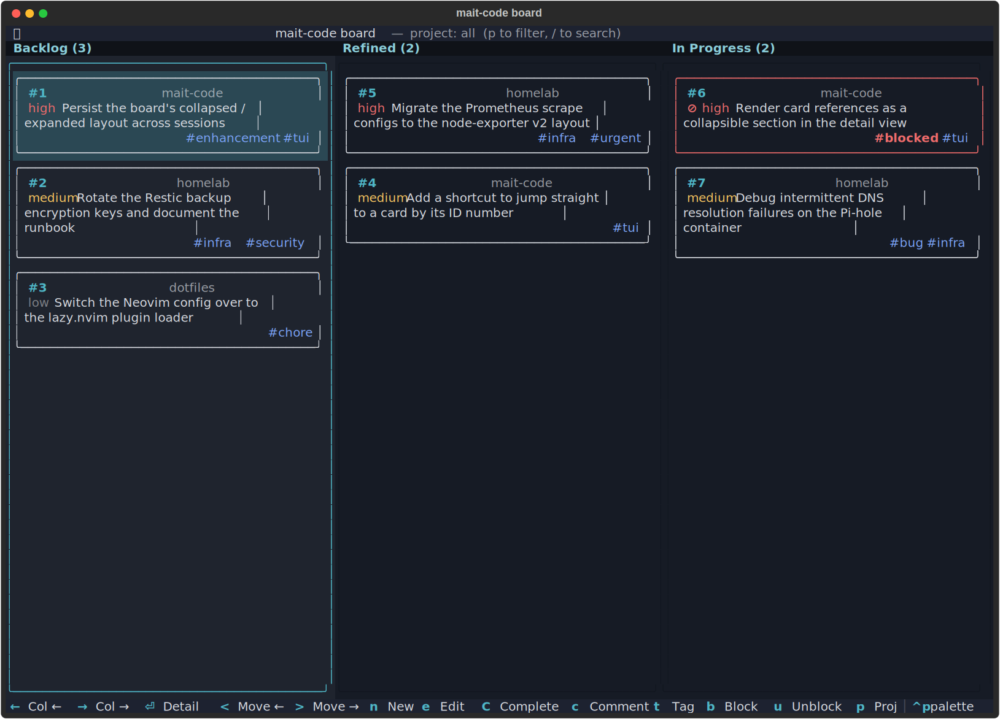
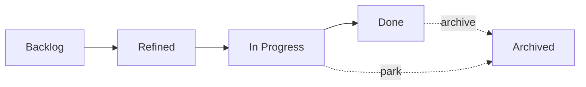
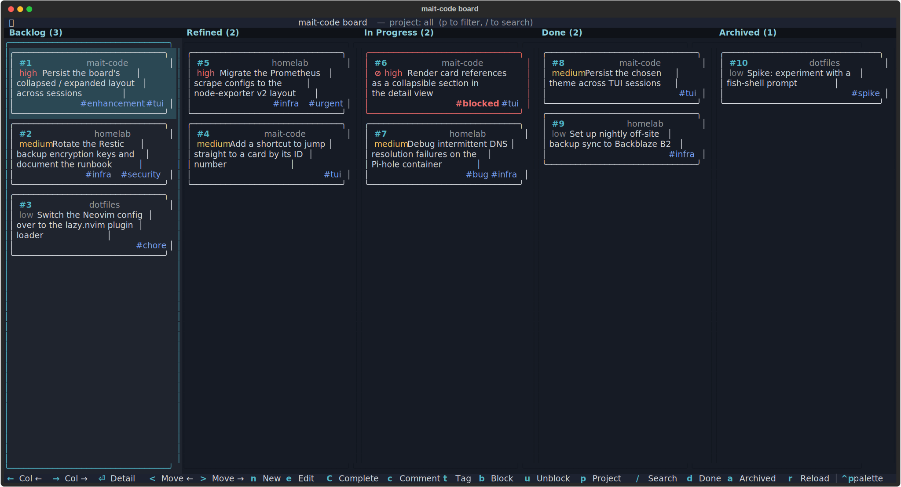
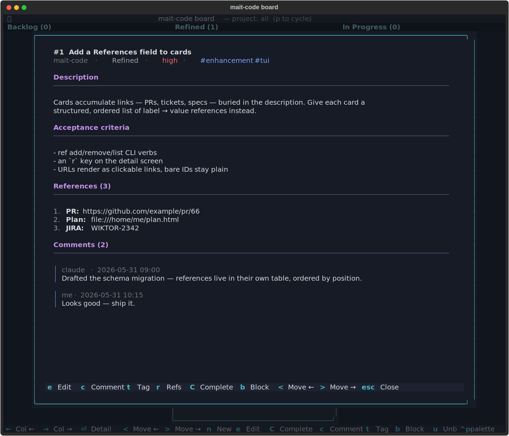

# The board

The board is a lightweight kanban that lives alongside your code. Cards capture
work — a bug, an idea, a half-formed feature — and flow through fixed columns as
you and Claude turn them into shipped changes. It is the spine of a reactive way
of working: instead of writing a long plan up front, you jot a card, refine it
when you get to it, and let Claude pick it up and do the work in the same
session.



## Why use it

A plan written before you understand the problem is a guess. The board lets you
defer that guess: park a rough idea in **Backlog**, sharpen it into a crisp
**Refined** card only when you're about to act on it, and keep the act of
*deciding what to do* separate from the act of *doing it*. The payoff is a
tighter, more interactive loop — less ceremony, more momentum — and a durable
record of what was done and why, because every completed card carries a handoff
summary.

The board spans **every project**. One store, filtered by project, so an idea
you have while working on repo A doesn't get lost when you switch to repo B.

## The mental model

The board is **manually driven, and Claude is the worker**. There is no
background dispatcher quietly shuffling cards — nothing moves unless you ask for
it. You decide what gets refined, what gets picked up, and what gets completed;
Claude does the refining and the building when you say so, and never moves,
completes, or archives a card on its own.

That distinction matters. The board isn't a notification system nagging you about
work — it's a shared surface the two of you reason over together.

## The lifecycle

Cards flow through four fixed columns, with one hidden side-state:



| Column | Meaning |
|--------|---------|
| **Backlog** | Raw, unrefined ideas. Where new cards land. |
| **Refined** | Has a clear description *and* acceptance criteria. Ready to be picked up. |
| **In&nbsp;Progress** | Actively being worked in the current session. |
| **Done** | Finished, with a completion summary. Hidden by default — press `d` to show. |
| **Archived** | Parked out of sight without deleting. Hidden by default — press `a` to show. |

You don't have to march cards through every column in order — you can move a card
anywhere via the CLI — but `backlog → refined → in_progress → done` is the
intended grain, and following it is what makes the workflow pay off.

!!! note "Blocked is a tag, not a column"
    A blocked card keeps its real column — a blocked refined card stays in
    **Refined**. Blocking just attaches a `blocked` tag (and records the reason
    as a comment), so you never lose track of *where* a card was when it stalled.
    `blocked` is just the most common of the free-form tags any card can carry.

### Collapsed for work, expanded for review

By default the board shows only the live columns — **Backlog**, **Refined**, and
**In&nbsp;Progress**. This collapsed view is the *working* layout: it keeps the
three columns you actually act on wide and uncluttered, with finished and parked
work tucked out of sight so it can't pull your attention.

Press `d` and `a` to reveal **Done** and **Archived** — the full five-column view:



This expanded layout is for *admin and reflection*, not for getting work done:
reviewing what's shipped, re-reading completion summaries, sweeping stale cards
into the archive, and taking stock of how much has moved. Step back into it when
you want the whole picture; collapse it again (`d`, `a`) when you want to get back
to the flow.

## Two ways in

There are two ways to drive the board, and they share the same store — changes in
one show up in the other.

### The TUI

Open the interactive board with:

```bash
mait-code board
```

This is a full-screen [Textual](https://textual.textualize.io/) app: arrow keys
to move around, single-key shortcuts to act on cards, `Ctrl+P` for the command
palette, and live theming. It's the best way to *see* the state of your work at a
glance and to do bulk triage by hand.

When you're not on a terminal that supports it (e.g. piping output, or in CI),
`mait-code board` falls back to a read-only text render of every project's board.

### The conversation

The more transformative path is to drive the board *through Claude*. Just talk:

- *"What's on the board?"* — Claude shows you the current cards.
- *"Refine card 12."* — Claude drafts a description and acceptance criteria,
  shows them to you for approval, then moves the card to **Refined**.
- *"Pick up the next refined card."* — Claude claims the highest-priority refined
  card, moves it to **In Progress**, reads its acceptance criteria, and gets to
  work — all in the same session.
- *"That's done."* — Claude completes the card with a summary of what changed.

This is the loop that replaces up-front planning: refine just-in-time, pick up,
build, complete, repeat.

## A session, end to end

A typical board-driven session looks like this:

1. **Capture.** Something occurs to you mid-task — *"the toast colours wash out on
   the ember theme."* You say so; Claude offers to add a card, you confirm, and it
   lands in **Backlog**. You don't break your flow to act on it.
2. **Refine.** Later, you're ready to tackle it: *"refine the toast-contrast card."*
   Claude drafts a description and acceptance criteria and shows them to you.
   You tweak the criteria, approve, and the card moves to **Refined**.
3. **Pick up.** *"Take the next refined card."* Claude claims it — moving it to
   **In Progress** — reads the acceptance criteria you both agreed on, and starts
   implementing against them.
4. **Track.** As work progresses, comments and references accrue on the card: a
   link to the PR, a note about a tricky edge case. If something stalls, *"block
   it — waiting on the upstream fix"* tags it `blocked` in place.
5. **Complete.** When the acceptance criteria are met: *"complete it, summary:
   re-derived chip colours from the theme palette."* The card moves to **Done**,
   stamped with the time and the handoff summary.

The acceptance criteria written at step 2 are the contract for steps 3 and 5 —
which is exactly why refining *before* picking up is worth the small ceremony.

## Anatomy of a card



Every card carries:

| Field | Notes |
|-------|-------|
| **Title** | Required. The one-line summary. |
| **Project** | Required at creation. Which repo (or idea) the card belongs to. |
| **Priority** | `low`, `medium` (default), or `high`. Drives pick-up order. |
| **Description** | Free text. The "what and why". |
| **Acceptance criteria** | Free text. The contract for *done*. Usually set when refining. |
| **References** | An ordered list of `label → value` links — a PR, a ticket, a file, a spec. Kept out of the description so they stay tidy and clickable. |
| **Tags** | Free-form labels that ride alongside status (`blocked`, `urgent`, …). |
| **Comments** | A threaded log — your notes and Claude's, each timestamped. |
| **Completion summary** | The handoff note recorded when the card reaches **Done**. |

**References** deserve a mention: they're a recent addition for keeping a card's
links structured rather than buried in prose. A value that looks like a URL
(`https://…`, `file://…`) renders as a clickable link in the TUI; a bare
identifier like `JIRA-2342` stays as plain text. Manage them in a card's edit
form (press <kbd>e</kbd> on the detail screen), or with the `ref` CLI commands.

## TUI reference

### Board view

| Key | Action |
|-----|--------|
| <kbd>←</kbd> / <kbd>→</kbd> | Focus the previous / next column |
| <kbd>↑</kbd> / <kbd>↓</kbd> | Highlight the previous / next card |
| <kbd>1</kbd>–<kbd>5</kbd> | Jump straight to a column |
| <kbd>Enter</kbd> | Open the highlighted card's detail screen |
| <kbd>n</kbd> | New card |
| <kbd>e</kbd> | Edit the highlighted card |
| <kbd>c</kbd> | Add a comment |
| <kbd>C</kbd> | Complete the card (prompts for a summary) |
| <kbd>t</kbd> | Add / remove a tag |
| <kbd>b</kbd> / <kbd>u</kbd> | Block / unblock |
| <kbd>&lt;</kbd> / <kbd>&gt;</kbd> | Move the card left / right through the flow |
| <kbd>p</kbd> | Filter by project (dropdown picker) |
| <kbd>d</kbd> | Toggle the **Done** column |
| <kbd>a</kbd> | Toggle the **Archived** pane |
| <kbd>r</kbd> | Reload the board from disk |
| <kbd>Ctrl</kbd>+<kbd>P</kbd> | Command palette (incl. theme switching) |

### Card detail screen

| Key | Action |
|-----|--------|
| <kbd>e</kbd> | Enter edit mode |
| <kbd>Ctrl</kbd>+<kbd>S</kbd> | Save changes (in edit mode) |
| <kbd>Esc</kbd> | Close the screen / cancel an edit |
| <kbd>c</kbd> | Add a comment |
| <kbd>C</kbd> | Complete the card |
| <kbd>b</kbd> / <kbd>u</kbd> | Block / unblock |

The edit form (<kbd>e</kbd>) is the single place a card is changed: title,
priority, **status**, **tags**, **references**, description and acceptance
criteria all live on one form. Tags, references and status are a working copy —
**Save** (<kbd>Ctrl</kbd>+<kbd>S</kbd>) applies them all at once, and <kbd>Esc</kbd>
discards every pending change. Block / unblock stay outside the form (they carry
a reason comment a plain tag can't), so the form's tag editor leaves the
`blocked` tag alone.

!!! tip "Theming"
    The board ships several house themes (`mait-dark`, `mait-ember`,
    `mait-aurora`, `mait-bubblegum`, `mait-syntax`) plus Textual's built-ins.
    Switch via <kbd>Ctrl</kbd>+<kbd>P</kbd> → search *theme*. Your choice
    persists across sessions.

## CLI reference

The TUI is a front-end over the `mc-tool-board` command, which you (or Claude)
can call directly. The same store backs both.

```bash
# View
mc-tool-board list [--all] [--status STATUS] [--archived] [--json]
mc-tool-board show ID [--json]
mc-tool-board summary [--all] [--project PROJECT] [--json]

# Create & edit
mc-tool-board add "<title>" [--description ...] [--priority low|medium|high] [--project ...]
mc-tool-board edit ID [--title ...] [--description ...] [--priority ...] [--acceptance ...]
mc-tool-board comment ID "<note>" [--author me|claude]

# Flow
mc-tool-board refine ID [--description ...] [--acceptance ...]   # → refined
mc-tool-board next [--project ...] [--claim] [--json]            # top refined card; --claim → in_progress
mc-tool-board complete ID --summary "<what was done>"            # → done
mc-tool-board move ID <backlog|refined|in_progress|done|archived>
mc-tool-board archive ID                                         # hide without deleting
mc-tool-board remove ID                                          # permanent delete

# Tags & blocking
mc-tool-board tag ID <tag>      /  mc-tool-board untag ID <tag>
mc-tool-board block ID "<reason>"  /  mc-tool-board unblock ID

# References
mc-tool-board ref add ID <label> <value>
mc-tool-board ref remove ID <position>
mc-tool-board ref list ID [--json]
```

`--json` on the read commands gives machine-readable output — handy for scripting
or for Claude to consume.

## Tips for getting the most from it

- **Capture freely, refine sparingly.** Backlog is cheap; a card you'll never act
  on costs nothing. Only spend effort refining when you're about to do the work —
  that's the whole point of deferring the plan.
- **Write acceptance criteria you'd accept.** They're the contract Claude builds
  against and the bar for completion. Vague criteria, vague results.
- **Let Claude claim the next card.** `pick up the next refined card` respects
  priority then age, so the board decides what's most important — you don't have
  to.
- **Use references, not description links.** A `PR → https://…` reference stays
  clickable and structured; the same URL pasted into the description is just text.
- **Complete with a real summary.** The handoff note is what makes **Done** a
  record rather than a graveyard — future-you (and Claude) will read it.
- **Block in place.** When work stalls, block it rather than dragging it back to
  Backlog. You keep the context of where it was and why it stopped.
